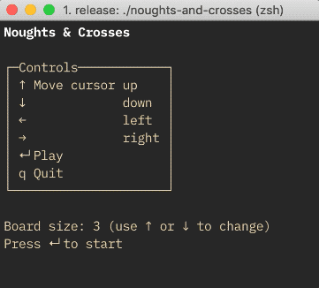

# Noughts and Crosses

A terminal-based Tic-Tac-Toe.

## Running

1. [Install a recent-ish Rust toolchain](https://www.rust-lang.org/tools/install)
2. `git clone git@github.com:davidcornu/noughts-and-crosses.git`
3. `cd noughts-and-crosses`
4. `cargo run`
